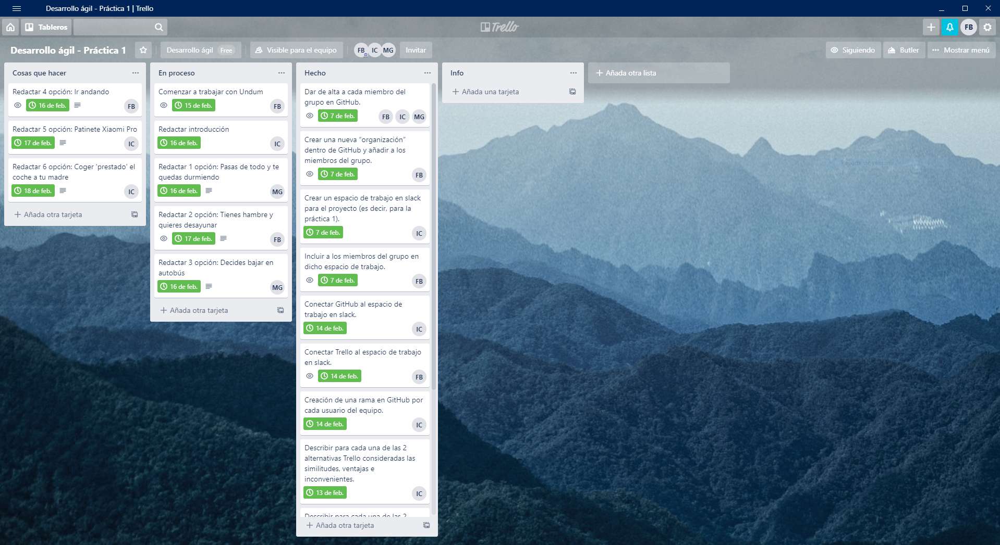

# Práctica 01
Esta práctica se puede realizar por grupos de 2 o 3 personas como máximo. Consistirá en darse de alta en las herramientas Trello, GitHub y Slack (que posteriormente usaremos en las prácticas) al mismo tiempo que se identifican posibles alternativas a cada una de ellas y se describen ventajas e inconvenientes. Finalmente, se realizará un primer proyecto, muy básico con Undum; este pequeño framework será también usado posteriormente en las prácticas.

## Alternativas a Slack considerando las similitudes, ventajas e inconvenientes
### Twist
Twist es una aplicación con las funciones clave de Slack, como la mensajería en hilos, la búsqueda en el historial y numerosas integraciones gratuitas.

Twist ofrece una interfaz limpia y de fácil aprendizaje y la versión gratuita incluye hasta cinco integraciones y 5 GB de espacio total de almacenamiento.

En la versión gratuita, los usuarios solo pueden realizar búsquedas en el historial del último mes, una limitación que podría afectar a la escalabilidad. Twist tampoco ofrece videoconferencias ni gestión de documentos, por lo que es más adecuada para pequeñas y medianas empresas que ya cuenten con herramientas para estos fines.

Link de descarga: https://get.twist.help/hc/es

### Fleep
Puede que Fleep tenga un nombre divertido, pero se trata de una herramienta de comunicación de lo más seria. De hecho, la empresa estonia encargada de su desarrollo afirma que su producto es “la forma perfecta de comunicarse”.

Aunque muchas de las herramientas de la lista se proponen superar o sustituir el correo electrónico, Fleep reconoce que este seguirá estando con nosotros durante mucho tiempo. Así pues, en lugar de intentar ignorar el correo electrónico, Fleep se integra con él (de manera similar a Google Hangouts en Gmail) y permite a los usuarios chatear desde su bandeja de entrada.

Y esa no es la única manera en la que Fleep abre líneas de comunicación. Fleep es una red abierta, así que sus usuarios pueden chatear con otros usuarios independientemente de su plataforma, organización o equipo. También es posible chatear con personas que no dispongan de Fleep; solo necesitas su dirección de correo electrónico para enviar tu chat de Fleep en un correo.

La versión gratuita incluye conversaciones ilimitadas e historial completo de mensajes. El equipo de Fleep está trabajando en una herramienta de gestión de tareas personales integrada que estará disponible para la versión de pago.

Link de descarga: https://fleep.io/downloads

## Alternativas a Trello
### monday.com – https://monday.com/
monday.com, una plataforma bastante galardonada. Es una de las pocas herramientas que se enorgullece de ‘no ser una herramienta de gestión de proyectos’. Han eliminado muchas las limitaciones de las herramientas típicas y se han centrado en estructuras simples que ayudan a aclarar la secuencia de trabajo que debe hacerse.

Esta herramienta es una gran alternativa de Trello que en realidad puede ofrecer un poco más de lo que Trello podría. Las características de monday.com incluyen múltiples vistas del trabajo: puedes verlo en listas, en mapas, en tableros Kanban, en hojas de cálculo, entre otras. Los usuarios pueden cargar y adjuntar archivos a tarjetas, dejar comentarios, mencionar compañeros de equipo y más. También ofrece un excelente panel de informes de proyectos que puede recopilar datos de múltiples paneles, lo que permite hacer un mejor seguimiento a las capacidades de progreso.

Algunas características destacadas de esta herramienta incluyen las funciones para automatizar ciertos procesos, así como tableros de tareas personalizables que permiten a los usuarios administrar tareas por tarjetas, asignatarios, fechas de vencimiento, horas dedicadas, etc. En general, es una herramienta altamente personalizable que te permite trabajar en la metodología que sea, ya sea kanban o no, que se adapte a tu proyecto y a tu equipo.

Las integraciones de monday.com incluyen aplicaciones de gestión de proyectos como Slack, Google Drive, Gmail, Google Calendar, Jira, GitHub, Trello, Dropbox, Typeform y muchas más, accesibles a través de Zapier.

monday.com cuesta desde $17/mes para dos usuarios. El servicio de atención al cliente de la empresa está disponible las 24 horas, los 7 días de la semana, por teléfono o correo electrónico.

### Kanbanize – https://kanbanize.com/
Kanbanize es fácilmente una de las mejores alternativas a Trello en el mercado. Creado por una empresa lean para equipos lean, Kanbanize es un software de gestión de proyectos lean que ayuda a las empresas de cualquier tamaño a organizar y gestionar el trabajo de manera eficiente. Es especialmente adecuado para equipos multifuncionales y entornos de proyectos múltiples.

Algo genial de Kanbanize es su motor de automatización: puede crear ganchos que desencadenan acciones cuando ocurren ciertos eventos. Esto te ayuda a ahorrar tiempo al automatizar procesos. Una de las últimas características de la plataforma te brinda la flexibilidad de crear flujos de trabajo completamente diferentes en un tablero Kanban, que es una característica única y útil que permite ver todo en un tablero mientras las tareas fluyan a través de sus respectivos flujos de trabajo personalizados. También tienen un potente panel de análisis que permite observar las diferentes tendencias del flujo de trabajo, como el tiempo del ciclo, la distribución de tareas, el vínculo de resolución de bloque y el mapa de calor del flujo de trabajo.

En cuanto las integraciones, Kanbanize viene con integraciones por defecto con herramientas populares como Google Drive, Dropbox, GitHub, Jira y otras herramientas (y también puede conectarse a través de Zapier).

En resumen, esta es una plataforma libre de errores que es fácil de usar y ofrece una gran visibilidad. De hecho, el único inconveniente que podemos encontrar con esta herramienta es que no está disponible sin conexión.

## Alternativas a GitHub:
### Bitbucket

Bitbucket se trata de otra plataforma muy popular en la que individuos y organizaciones tienden a almacenar sus repositorios basados en código libre. Permite tener repositorios públicos, como así también privados ilimitados, lo cual atrae la atención de los desarrolladores que acostumbran a necesitar espacio de almacenamiento para almacenar sus archivos en la nube. Una de las funciones más destacadas de Bitbucket es el hecho de permitir a los usuarios intercambiar o enviar achivos a otros usuarios a través de la misma plataforma.

También podremos encontrar un cliente gratuito de Bitbucket para Windows y Mac, el cual podemos utilizar sin problemas, además claro de la versión web de esta plataforma.

Por medio de Bitbucket también podremos alojar una página web gratis a través de un subdominio (usuario.bitbucket.org) y podremos tener páginas de nuestro proyecto (usuario.bitbucket.org/proyecto).

También podremos utilizar dominios propios para tener nuestra página web personalizada basada en Bitbucket. También podremos formar equipos dentro de esta plataforma, con repositorios públicos o privados, siempre y cuando los equipos no superen los 5 usuarios. Si deseamos tener equipos de trabajo con usuarios ilimitados deberemos mantener todos nuestros proyectos completamente públicos.

### SourceForge
SourceForge es otra reconocida página web en el que desarrolladores acostumbran a publicar sus proyectos basados en diferentes plataformas y compatibles con los más variados sistemas operativos, como Linux, Windows y Mac. Una de las particularidades de SourceForge es que permite únicamente crear proyectos de código abierto con nombre único, por lo que deberemos ser originales al momento de publicar nuestras creaciones. SourceForge también nos permite crear una página web con subdominio (proyecto.sourceforge.net), por lo que le resultará más práctico al usuario que busca mantener una organización de sus trabajos, y de igual manera mostrar al público todos los proyectos que ha llevado a cabo.

Debemos señalar también que los servidores de SourceForge tienen compatibilidad con una gran cantidad de lenguajes de programación, como por ejemplo PHP, Perl, Ruby, Python, lo que le permitirá al usuario crear y publicar sus proyectos sin demasiadas limitaciones dentro de esta plataforma. También podremos utilizar un cliente SFTP para poder cargar nuestros archivos a los servidores de SourceForge.

## Capturas de pantalla
### Trello

### Slack